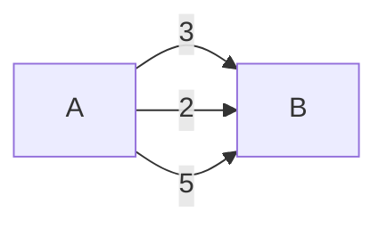
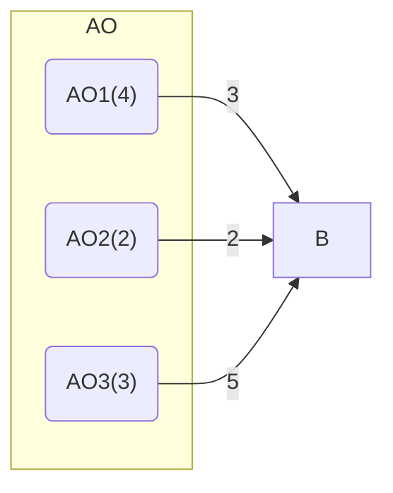
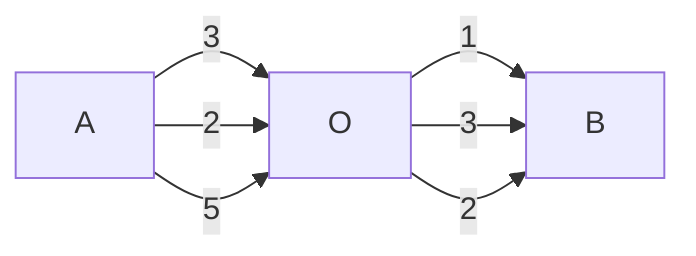
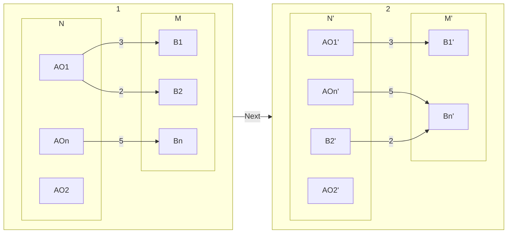

# Dijkstra's Algorithm

核心是最短路径上的任意两点也是最短路径



$$D(A, B) = \min (3, 2, 5)$$

---



$$D(A, B) = \min \{AO_i + O_i B \}$$

---

注意到, 有$AO_i, O_i B$也是最短的

$$D(A, B) = \min \{D(A, O_i) + D(O_i, B) \}$$



---

用二部图思考



没有连接的是无穷

可以证明$D(A, B_2) = AO_1 \rightarrow B_2$

整个过程, 有 N 不断增大, M 不断减小, 直到结束

---

有几点观察:

- 找到 NM 之间的最短, 即图中的'2', 很像$\min \{D(A, O_i) + D(O_i, B) \}$的 min, 连接起两个图的结构
- 算法的过程, 图的结构大体结构不变, 符合递归

  因此, 感觉递归具有结构不变性

- 二部图结构, 让我想到二元运算

  ```hs
  f (A, B) = (A', B')
  ```

  图的结构在变化, 在某种程度上有没有变

- 贪心的过程, N 不断增大, M 不断减小, 刻画了一种探索方式, N 是已知, M 是未知
